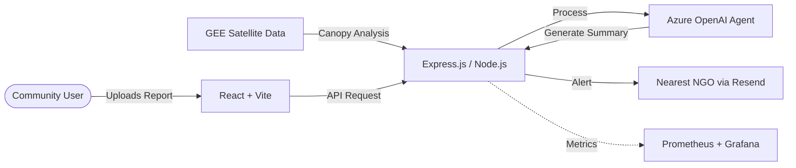
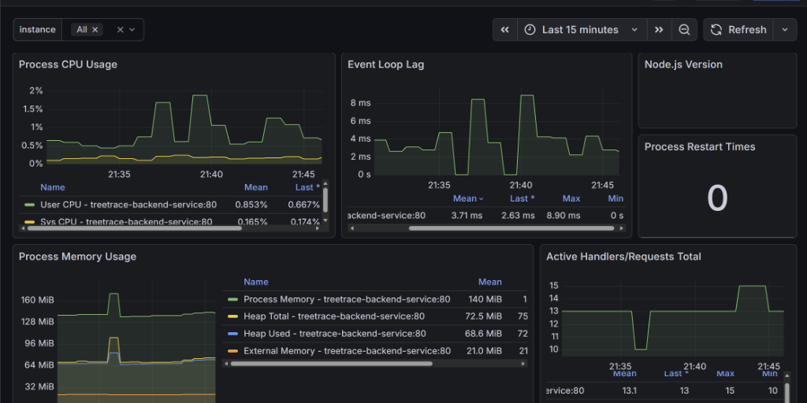

# 🌳 TreeTrace: Satellite-Driven Forest Monitoring

[](#)
[](#)
[](#)
[](#)

**TreeTrace** is a mission-critical platform designed to combat deforestation using the power of satellite intelligence and AI. We provide a 24/7 surveillance system that transforms raw space data into actionable community alerts with a **99.9% availability guarantee**. 🌍✨

### 🌐 Live Links
- **Main Frontend**: [https://treetrace.tech](https://treetrace.tech)
- **Backend API**: [https://api.treetrace.tech](https://api.treetrace.tech)

---


## 🎯 The Core Problem 🌋

- **🕵️ Invisible Deforestation**: Illegal logging often happens in remote, unmonitored areas where it goes unnoticed for months.
- **📊 Technical Barrier**: Satellite data is incredibly powerful but too complex for most local communities and NGOs to interpret.
- **⏳ The Response Lag**: Traditional monitoring follows a "detect-and-report" cycle that is too slow to stop environmental damage in real-time.

---

## ✅ The TreeTrace Solution 🛡️

- **🛰️ Automated Space Monitoring**: We use **Google Earth Engine (GEE)** to run real-time canopy health checks across vast forest regions.
- **🧠 Intelligent Insights**: Native integration with **Azure OpenAI (GPT-4o)** turns massive satellite datasets into simple, natural language reports.
- **📍 Community-NGO Bridge**: A geo-intelligent routing system that connects ground-truth reports directly to the nearest response team.
- **🏗️ Enterprise Reliability**: A cloud-native architecture deployed on **AKS** ensuring **99.9% uptime** for constant environmental protection.

---

## 🏗️ System Architecture & Flow



---

## 🛠️ Tech Stack & Operational Excellence 💻

### **Product Stack**
- **🎨 Frontend**: Developed with **React (Vite)** and **Tailwind CSS** for a responsive, high-performance user interface.
- **🗺️ Geo-Spatial**: Integrated **Leaflet.js** for interactive map visualization and geo-intelligent monitoring.
- **🟢 Backend**: A robust **Express.js** API layer designed for high throughput and low latency.
- **🍃 Database**: **MongoDB** with Mongoose for resilient, document-oriented data management.
- **🤖 Intelligence**: **Azure OpenAI SDK** for deep content analysis and **Google Earth Engine SDK** for spatial computing.

### **Infrastructure & Reliability (99.9% Uptime)**
- **☸️ Orchestration**: **Azure Kubernetes Service (AKS)** manages our containers, providing self-healing and automated scaling.
- **🐳 Containerization**: Standardized **Docker** images ensure consistency across development, staging, and production.
- **📊 Observability**: A professional monitoring suite using **Prometheus** to scrape real-time metrics and **Grafana** for visual system health tracking.
- **🔄 Zero-Downtime**: CI/CD ready with rolling updates to ensure our environmental monitoring never pauses.

---

## 🚀 CI/CD Pipeline 🛠️

We use **GitHub Actions** for automated testing and deployment. Every push to `main` triggers:
1. **🏗️ Build**: Containerizes the backend application using Docker.
2. **📦 Publish**: Pushes the image to **Docker Hub** with the `:latest` tag.
3. **🌐 Deploy**: Securely connects to **Azure** and triggers a `rollout restart` on the **AKS** cluster to apply changes without downtime.

---

## 📊 Performance & Load Testing

To verify system stability, the API was stress-tested by sending 100 parallel requests simultaneously. You can reproduce this test using the following PowerShell script:

```powershell
$url = "https://api.treetrace.tech/"
1..100 | ForEach-Object {
     Start-Job -ScriptBlock {
         curl.exe -s -o $null -w "%{http_code}\n" "https://api.treetrace.tech/"
     }
}
Get-Job | Wait-Job | Receive-Job
```

Real-time Grafana monitoring captured these exact metrics during the traffic spike:

- **Zero Downtime**: The backend successfully processed all requests with exactly 0 process restarts.
- **Non-Blocking Execution**: The maximum Node.js Event Loop Lag peaked at just **8.90 ms**, ensuring the main thread remained highly responsive.
- **Memory Efficiency**: Process memory stayed stable between **140 MiB and 160 MiB**, proving effective garbage collection with zero memory leaks.
- **Low CPU Cost**: The server consumed **less than 2% CPU** at peak load, showing highly optimized resource usage.



---

## 📦 Kubernetes Deployment Guide

To deploy the production-ready infrastructure on AKS, use the following commands:

```bash
# 1. Apply Secrets (Ensure treetrace-backend-secret.yaml is configured)
kubectl apply -f backend/k8s-specifications/treetrace-backend-secret.yaml

# 2. Deploy the core Backend and Service
kubectl apply -f backend/k8s-specifications/treetrace-backend.yaml

# 3. Setup Ingress (HTTPS & Routing)
kubectl apply -f backend/k8s-specifications/treetrace-backend-ingress.yaml

# 4. (Optional) Setup Monitoring Ingress
kubectl apply -f backend/k8s-specifications/monitoring-ingress.yaml

# 5. Verify the deployment
kubectl get pods
```

---

## 💻 Local Development Setup

1. **Clone & Install**:
   ```bash
   git clone https://github.com/AsadAhmedSaiyed/TreeTrace.git
   cd backend && npm install
   cd ../frontend && npm install
   ```
2. **Configure**: Fill in your `.env` files with API keys (Clerk, MongoDB, GEE, Azure).
3. **Launch**:
   ```bash
   npm start          # Backend server
   npm run dev        # Frontend (in another terminal)
   ```

---

<p align="center">
  <b>Built for Global Impact by Asad Ahmed Saiyed</b> <br>
  <i>Leading the way in 99.9% Reliable Environmental Monitoring</i> 🌳✨
</p>

